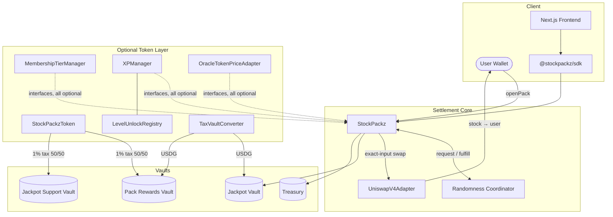
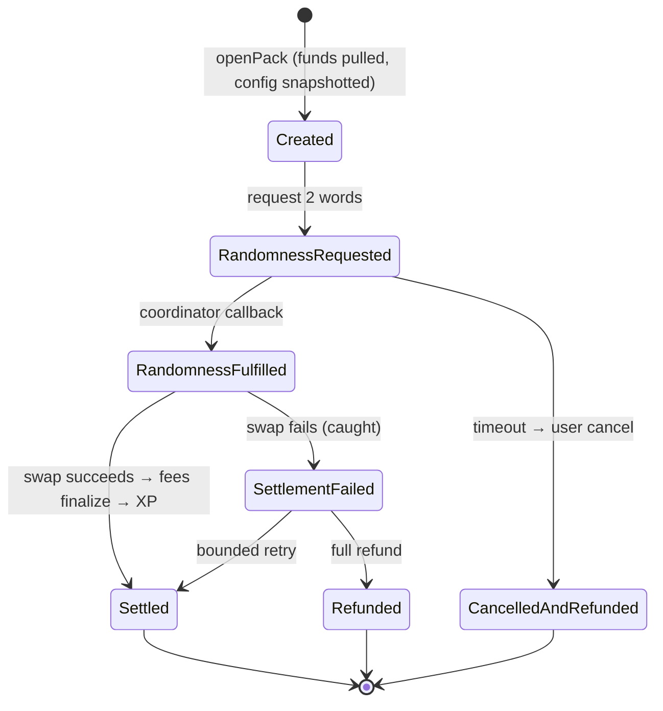

# Architecture

StockPackz is a modular protocol: a core settlement engine surrounded by optional, interface-connected modules. The core never depends on any module being present — the base product functions with every optional module unset.

## System overview

## Contract map

| Contract | Responsibility |
| --- | --- |
| `StockPackz` | Pack configs, opening state machine, jackpot, liability accounting |
| `UniswapV4Adapter` | Routing behind `IStockSwapAdapter`: allowlists, pair flags, liquidity floors |
| `StockPackzToken` | Optional ERC-20; 1% transfer tax split 50/50 into two vaults; no reflections, no buyback |
| `TaxVaultConverter` | Keeper-driven, slippage-bounded conversion of taxed tokens into USDG |
| `PackRewardsVault` | Pre-funded USDG for subsidies, key packs, and rewards; pull-or-fallback semantics |
| `MembershipTierManager` | Configurable tiers: discounts, subsidies, XP multipliers, access flags |
| `XPManager` | Settlement-gated XP, configurable level curve, seasons/streak/prestige fields |
| `LevelUnlockRegistry` | Additive level → unlock mapping; new rewards without core changes |
| `PackCredits` | Non-transferable USDG-backed credits with weekly epochs |
| `CollectionBadges` | Soulbound achievement NFTs with on-chain balance verification |
| `OracleTokenPriceAdapter` | Staleness- and bounds-checked USD pricing for burn quantities |

## Opening lifecycle

Key invariants:

1. **Payment before selection.** Randomness is requested only after funds are committed; the stock cannot be known earlier.
2. **Snapshots are law.** Stock sets, weights, fees, jackpot odds, adapter, and tier benefits are frozen per opening. Admin changes affect only future openings.
3. **Fees follow settlement.** Treasury and jackpot legs finalize only when the stock purchase succeeds.
4. **Liabilities are untouchable.** `withdrawTreasury` is capped at accrued fees and can never dip into pending settlements or the jackpot.

## Economic flow

Every default opening splits 10 USDG:

| Leg | Amount | Notes |
| --- | --- | --- |
| Stock purchase | 9.00 | + optional tier subsidy pulled from the Rewards Vault |
| Treasury | 0.60 | − holder discount (discount can never exceed this leg) |
| Jackpot | 0.40 | Fixed, never discounted |

Token holders additionally burn ≈ $0.05 of STOCKPACKZ per opening (oracle-priced); non-holders pay a 0.20 USDG surcharge instead. The guaranteed stock leg is identical in both flows.

## Frontend

The Next.js app mirrors the on-chain state machine (`src/lib/protocol.ts`) and gates the reveal animation on the authoritative server draw. API routes under `src/app/api/*` simulate the production indexer surface: jackpot, activity, stocks, and pack opening.
