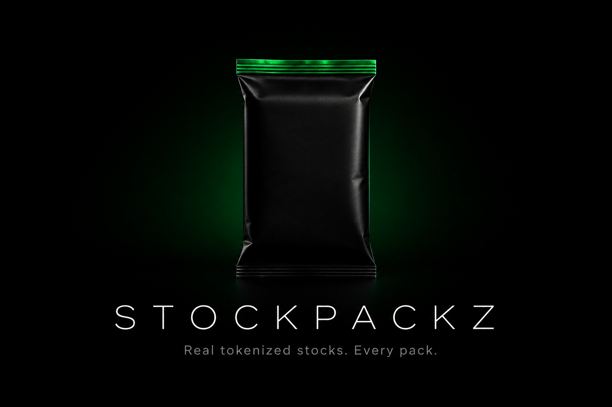
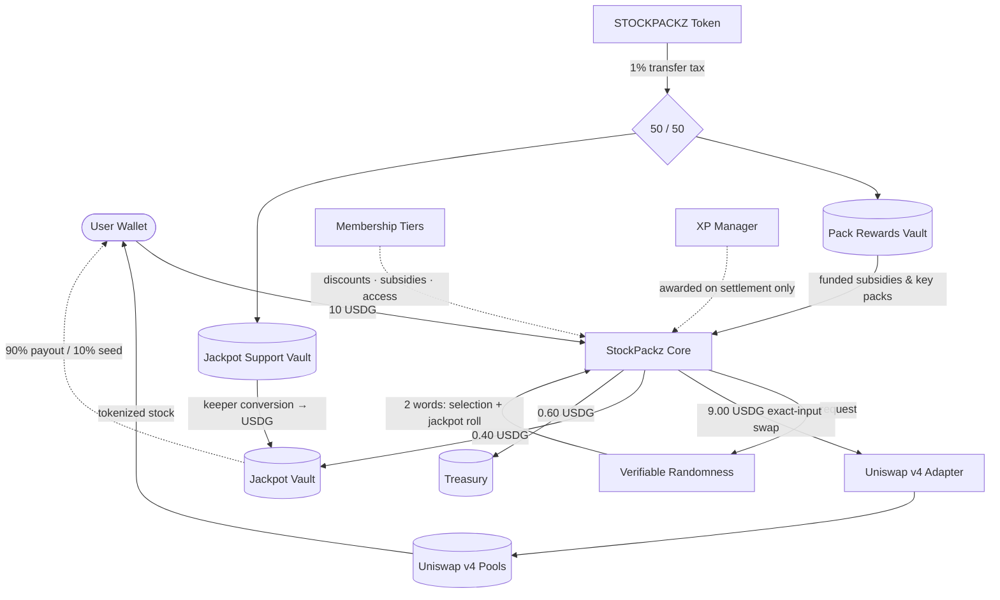

<div align="center">



<br />
<br />

**Open. Own. Invest.**

Every StockPack settles into real tokenized stocks on Robinhood Chain — just-in-time, verifiably random, directly to your wallet.

<br />

[](https://github.com/stockpackz/stockpackz/actions/workflows/contracts.yml)
[](https://github.com/stockpackz/stockpackz/actions/workflows/frontend.yml)
[](contracts/test)
[](contracts)
[](https://getfoundry.sh)
[](sdk)
[](LICENSE)
[](AUDIT_SCOPE.md)
[](SECURITY.md)

[Documentation](docs) · [Architecture](ARCHITECTURE.md) · [Security](SECURITY.md) · [Roadmap](ROADMAP.md) · [Contributing](CONTRIBUTING.md)

</div>

---

## What is StockPackz?

StockPackz is a pack-opening protocol for real equities. A user pays 10 USDG, verifiable randomness selects a company from public, weighted odds, and the protocol purchases that company's tokenized stock through Uniswap v4 — settling directly into the user's wallet. No inventory. No IOUs. No custody.

```
10 USDG in  →  9.00 buys the stock  ·  0.60 protocol  ·  0.40 shared jackpot
```

## Features

- **Verifiable Randomness** — Every opening is selected by cryptographically verifiable randomness. The stock is never chosen before payment is committed, and configuration is snapshotted per opening so odds can never change mid-flight.

- **Just-In-Time Settlement** — The protocol holds zero stock inventory. Every opening swaps USDG into the selected tokenized equity through Uniswap v4 at execution price and delivers it directly to the buyer's wallet.

- **Public, Immutable Odds** — Every pack publishes its exact selection weights on-chain (basis points of 10,000). Rarity changes probability, never payout size — every opening funds the same guaranteed purchase.

- **Failure-Safe by Design** — A failed swap can never take a user's money. Openings park in a recoverable state with bounded retry or a full refund; fees are only finalized after the stock settles.

- **Liability-Aware Treasury** — User settlements, the jackpot, and reward backing are accounted as liabilities the admin structurally cannot withdraw.

- **Shared Jackpot Vault** — Every opening contributes to one global USDG jackpot with published odds (≈ 1 in 25,000). Winners receive 90%; 10% seeds the next vault.

- **Optional Token Layer** — Membership tiers, discounts, funded stock subsidies, XP progression, and gated packs. The core product is fully functional without the token at any token price.

- **Progression That Settles** — XP is awarded only after a successful on-chain settlement. Levels, unlocks, and gated packs are driven by configurable on-chain curves and registries.

## Architecture



A deeper walkthrough lives in [ARCHITECTURE.md](ARCHITECTURE.md) and [docs/](docs).

## Repository structure

```
├── contracts/          Solidity protocol (Foundry)
│   ├── src/            Core, adapters, vaults, membership, progression
│   └── test/           68 unit + integration tests, deterministic randomness
├── src/                Next.js 16 frontend (App Router, Tailwind v4)
├── sdk/                TypeScript SDK (@stockpackz/sdk)
├── examples/           Runnable SDK examples
├── docs/               Protocol documentation (also rendered at /docs)
└── .github/            CI, issue templates, security policy wiring
```

## Quick start

**Frontend**

```bash
npm install
npm run dev          # http://localhost:3000
```

**Contracts**

```bash
cd contracts
forge build
forge test           # full suite, deterministic randomness injection
```

**SDK**

```ts
import { StockPackzClient } from "@stockpackz/sdk";

const client = new StockPackzClient({ chain: "robinhood" });

const pack = await client.packs.get(1n);
const opening = await client.packs.open({ packId: 1n, maxSlippageBps: 100 });
console.log(opening.selectedStock, opening.stockAmountReceived);
```

More in [examples/](examples).

## Testing

The contract suite injects known random words through a mock coordinator, making every draw deterministic and every edge reachable: weighted-selection boundaries and distribution, exact fee splits, jackpot payout ordering, snapshot immunity to admin changes, swap-failure → retry/refund branches, oracle staleness fallbacks, and liability-capped withdrawals.

```bash
cd contracts && forge test -vvv
```

## Security

Security documentation follows the protocol, not the other way around:

- [SECURITY.md](SECURITY.md) — threat model, trust assumptions, known limitations, responsible disclosure
- [AUDIT_SCOPE.md](AUDIT_SCOPE.md) — audit surface and invariants
- [docs/12-threat-model.md](docs/12-threat-model.md) — attacker-by-attacker analysis

The protocol is **pre-audit**. Do not deploy to mainnet with real funds.

## Roadmap

| Phase | Scope | Status |
| --- | --- | --- |
| 1 — Core Packs | Pack engine, JIT settlement, jackpot, tiers, XP, Founder Packs | ✅ Implemented |
| 2 — Progression | Staking, Pack Printer, keys, seasons, leaderboards | 🔨 In design |
| 3 — Platform | TypeScript SDK GA, Creator Packs, tax-conversion automation | 📋 Planned |
| 4 — Community | Community Packs, governance over pack themes | 📋 Planned |

Full details in [ROADMAP.md](ROADMAP.md).

## Contributing

Contributions are welcome — read [CONTRIBUTING.md](CONTRIBUTING.md) for setup, coding standards, and the PR checklist. All participants are expected to follow the [Code of Conduct](CODE_OF_CONDUCT.md).

## License

[MIT](LICENSE) © StockPackz contributors
